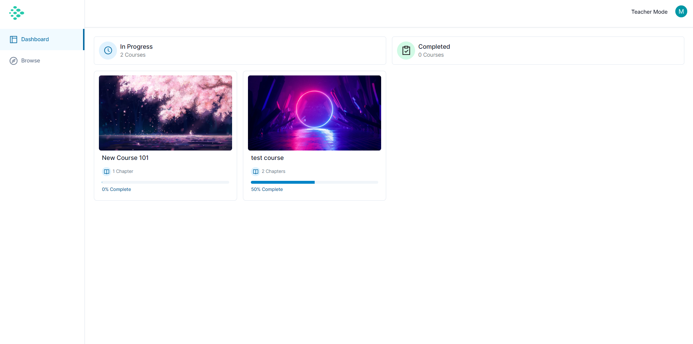
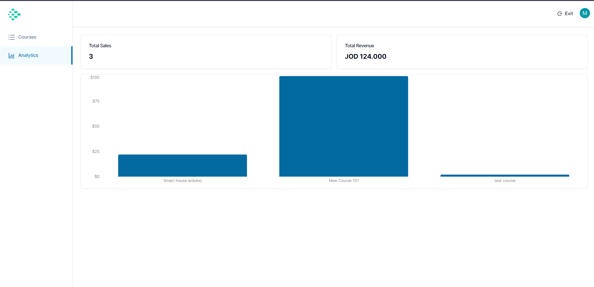
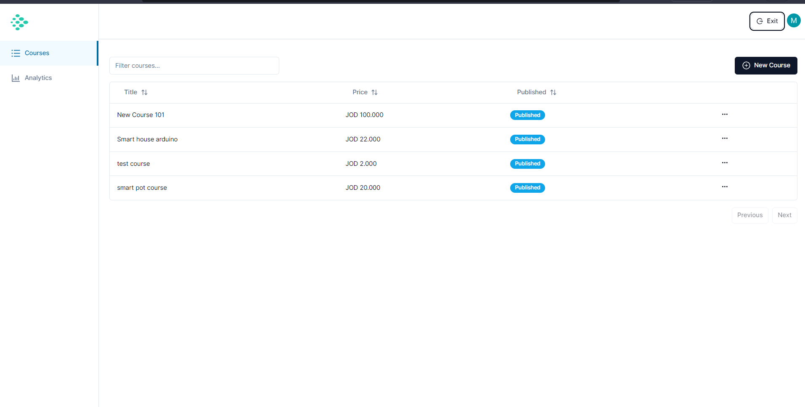
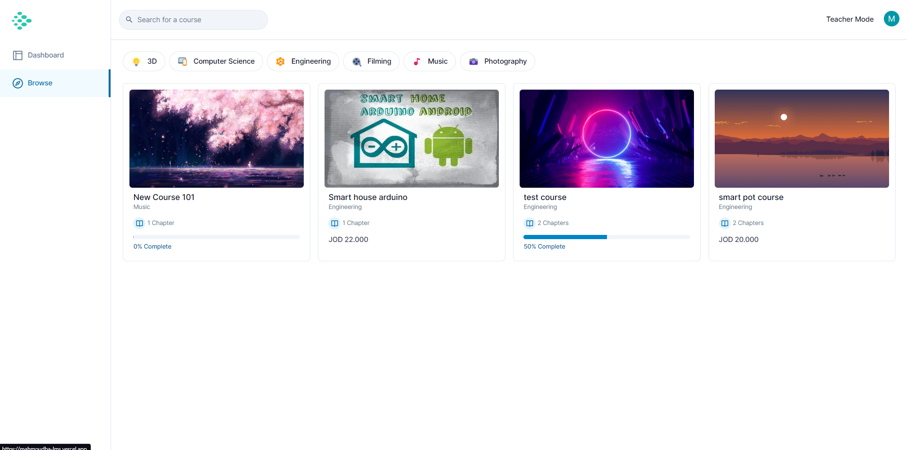
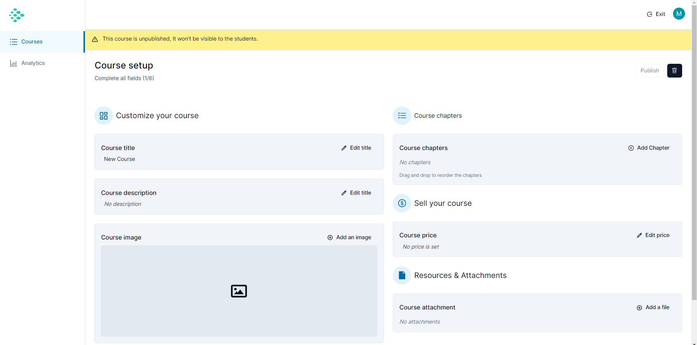
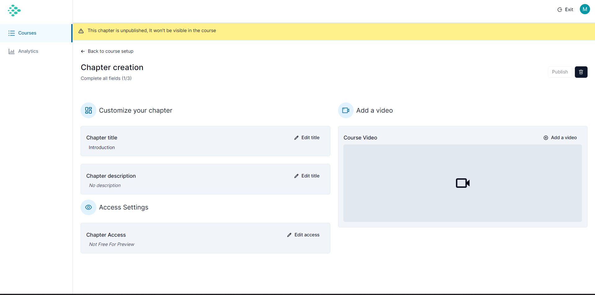

# Learning Management System (LMS) Website Documentation

## Introduction

This document provides comprehensive information about the Learning Management System (LMS) website, a project designed to offer a seamless educational experience. Developed with Next.js for the frontend and backend, Clerk for authentication, Shadcn and Tailwind for styling, Mux for video processing, Uploadthing for file uploads, Prisma for database management, database hosted on railway, Stripe for payments, and TypeScript for enhanced type safety.

## Live Preview

Visit the live preview of the Learning Management System (LMS) website [here](https://mahmoudba-lms.vercel.app).

## Features

### User Roles

1. **Teacher:**

   - Creates and publishes courses.
   - Monitors analytics, including total revenue and sales.

2. **Student:**
   - Purchases courses.
   - Views purchased courses in the dashboard.
   - Tracks progress within courses.

### Teacher Features

- **Course Management:**
  - Creates and publishes courses.
  - Monitors course analytics (total revenue and sales).

### Student Features

- **Course Purchasing:**

  - Purchases courses from the browse tab.

- **Dashboard:**

  - Views purchased courses.
  - Monitors progress within courses.

- **Course Search:**
  - Searches courses by category or name.

## Technology Stack

- **Frontend:**

  - Next.js
  - Hello Pangea/dnd
  - Hoo Zod
  - React Icons
  - Axios
  - Clerk
  - Query-string
  - Tailwind
  - Recharts
  - React-Quill

- **Backend:**

  - Next.js (server-side rendering)
  - Prisma (database management)

- **Video Processing:**

  - Mux
  - Mux Player React

- **File Uploads:**

  - Uploadthing

- **Authentication:**

  - Clerk

- **Payment:**

  - Stripe

- **Additional Tools:**
  - Shadcn (styling)
  - TypeScript

